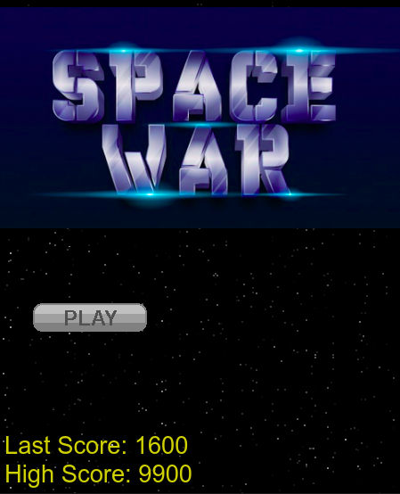
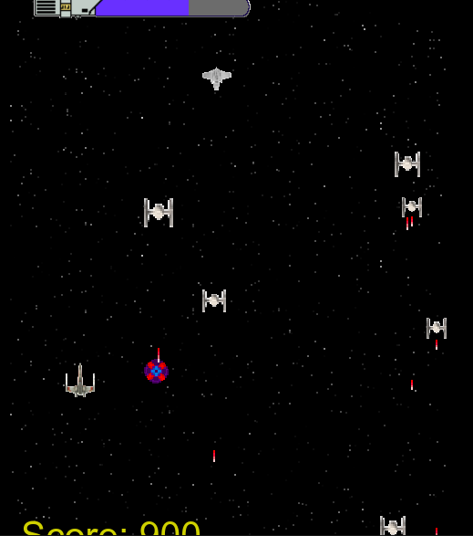
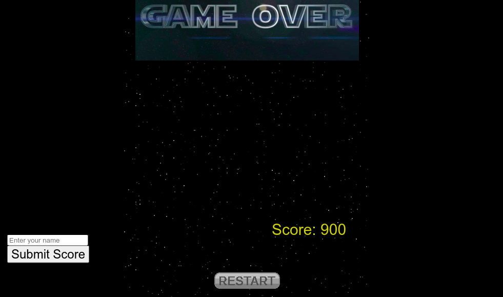
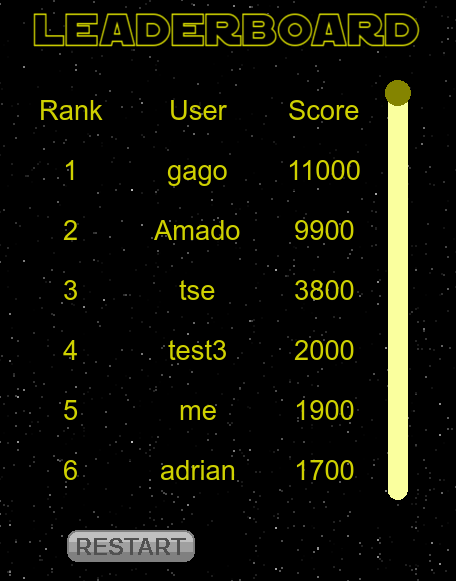

# Space War Game

### In this project, I build a shooter game using JavaScript's framework phaser3. It is open-source framework for Canvas and WebGL powered browser games.

### This game has 4 scenes: gameOver, leaderBoard, main and mainMenu.

## How to play:

- You can play online [live version](https://space-war-game.vercel.app/) or local.

- Click on Download ZIP in repository.

- Extract the game.

- In your terminal, navigate to the game's folder.

- Run 'yarn start'.

- Open in your browser, 'localhost:8000'.

- Use spacebar to fire and arrow keys to move.

## Run tests

- In your terminal, navigate to the game's folder.

- Run `yarn test`

## Technologies used:

- Javascript
- phaser3
- Webpack
- Eslint
- Babel
- Express
- Vercel to deploy

## Game design:

#### Player ship: 

#### Health : 

#### Enemies:

- It gives you 300 points when destroyed. 

- It won't shoot you and will give you 500 points. 

- The bomb will follow you until be destroyed or give you some damage. 

#### Scenes:

- SceneMainMenu

- SceneMain

- SceneGameOver

- SceneLeaderBoard

## Live Version

[live version](https://space-war-game.vercel.app/)

## Author

👤 **Ammar El refay Kandel**

- GitHub: [ammarkandel](https://github.com/ammarkandel)
- Twitter: [@AmmarQandel](https://twitter.com/AmmarQandel)
- LinkedIn: [LinkedIn](https://www.linkedin.com/in/ammar-kandel-7b4100193/)

## Acknowledgements

- Microverse
